# **KS0470 4WD BT Multi-purpose Smart Car V2.0 Kit Mixly tutorial**

## 1. Introduction

Nowadays, technological education such as VR, kids programming, and artificial
intelligence, has become mainstream in educational industry. Thereby, people
attach importance to STEAM education.

The 4WD multi-purpose robot car, newly upgraded by the Keyes team, is one of the
most favoured programming robots.

It is not only beautiful in appearance, but also powerful in function. In
addition to the common function like line tracking, obstacle avoidance and
remote control, etc.

15 learning projects, from simple to complex, will guide you how to make a smart
4wd robot on you own and introduce the detailed knowledge about sensors and
modules.

Simultaneously, it is the best choice if you intend to obtain a DIY robot for
learning programming, entertainment and competition requirement.

**Note: The experiment you did should be in line with wiring diagram, including
about components and wiring method. For example, we supply power with external
power in the hook-up diagram, so you also have to use external power rather than
USB cable .**

## 2. Features

1. Multi-purpose function: Obstacle avoidance, follow, IR remote control,
    Bluetooth control, ultrasonic follow and displayed face emoticons.

2. Simple assembly: No soldering circuit required, complete assembly easily.

3. High Tenacity: Aluminum alloy bracket, metal motors, high quality wheels and
tracks

4. High extension: expand other sensors and modules through motor driver shield
and sensor shield

5. Multiple controls: IR remote control, App control(IOS and Android system)

6. Basic programming：Mixly programming.

## 3. Specification

Working voltage: 5v

Input voltage: 7-12V

Maximum output current: 2A

Maximum power dissipation: 25W (T=75℃)

Motor speed: 5V 200 rpm/min

Motor drive mode: dual H bridge drive

Ultrasonic induction angle: \<15 degrees

Ultrasonic detection distance: 2cm-400cm

Infrared remote control distance: 10 meters (measured)

Bluetooth remote control distance: 50 meters (measured)

Bluetooth control: support Android and iOS system

## 4. Product List

| No | Name                                     | QTY |                  Picture                       |
|----|------------------------------------------|-----|------------------------------------------------|
| 1  | Keyestudio V4.0 Board                    | 1   | |
| 2  | Keyestudio Motor Driver Shield| 1        |     | |
| 3  | Keyestudio HM-10 Bluetooth-4.0           | 1   | |
| 4  | Red LED Module                           | 1   | |
| 5  | HC-SR04 Ultrasonic Sensor                | 1   | |
| 6  | Keyestudio Line Tracking Sensor          | 1   | |
| 7  | Keyestudio IR Receiver Sensor            | 1   | |
| 8  | Keyestudio 8\*16 LED  Dot Matrix         | 1   | |
|    |  4pinDupont Line                         |     |                                                |
| 9  | Keyestudio 9G Servo                      | 1   | |
| 10 | Keyestudio Remote Control                | 1   | |
| 11 | USB Cable                                | 1   | |
| 12 | 18650 Battery Holder                     | 1   | |
| 13 | 6 AA Battery Holder                      | 1   | |
| 14 | Servo Platform                           | 1   | 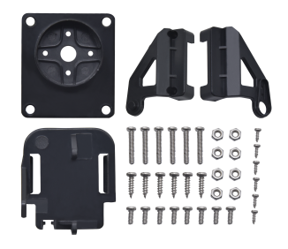|
| 15 | 15CM F-F 5P 24AWG Dupont Wire            | 1   | |
| 16 | 8cm F-F 3P 24AWG  Dupont Wire            | 1   | |
| 17 | 4P to 1P Female  DuPont Wire             | 1   | |
| 18 | Acrylic Board                            | 1   | |
| 19 | Keyestudio 4WD Smart Car V2.0 Top Board  | 1   | |
| 20 | Keyestudio 4WD Smart Car V2.0 Bottom PCB | 1   | |
| 21 | Fixed Parts                              | 4   | |
| 22 | Wheel                                    | 4   |  |
| 23 | M3\*10MM Dual-pass  Copper Bush          | 10  | |
| 24 | M3\*40MM Dual-pass  Copper Bush          | 4   | |
| 25 | M3\*30MM Round Head Screws               | 8   | |
| 26 | M3\*6MM Round Head Screws                | 40  | 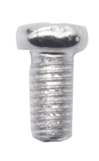 |
| 27 | M3 Nickel Plated Nuts                    | 16  | 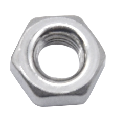|
| 28 | M2X8MM Round Head Screws                 | 6   | |
| 29 | M3\*8MM Round Head Screws                | 4   | |
| 30 | M2 Nickel Plated Nuts                    | 6   | |
| 31 | M3\*10MM Flat Screws                     | 3   | |
| 32 |  Motor (with welding wire)               | 4   | |
| 33 | 3\*40MM Screwdriver                      | 1   | |
| 34 | Black Nylon Ties 3\*100MM                | 6   | |
| 35 |  Winding Pipe                            | 1   | |
| 36 | 3Pin F-F Dupont Wire (20CM)              | 3   | |
| 37 | Decorative Board                         |     | |

## 5.Install Mixly Software and Driver

1.  **Download and Install Mixly**

Description

Mixly is a free open-source graphical Arduino programming software, based on
Google’s Blockly graphical programming framework, and developed by Mixly Team@
BNU.

It is a complete support ecosystem for creative e-education, a stage for maker
educators to realize their dreams.

② Download Mixly1.0

Windows System：<https://fs.keyestudio.com/Mixly1-Windows>

MACOS System：<https://fs.keyestudio.com/Mixly1-MACOS>

We will take Mixly1.0 (Windows version) as example, and the installation method
of MAC version is similar with it.

You will get installation package after downloading. As shown below:

Unzip the package, you will see “Mixly 1.0 for keyestudio.exe”

Double-click ”Mixly 1.0 for
keyestudio.exe”, the following interface pops up.

We have to choose correct Arduino development board and name, as shown below:

Select correct COM port(the corresponding port will be shown after installing
driver successfully)

You have to know the function of every area and interface on Mixly software
before uploading program on Arduino development board

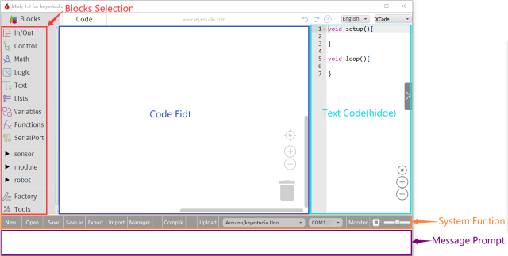

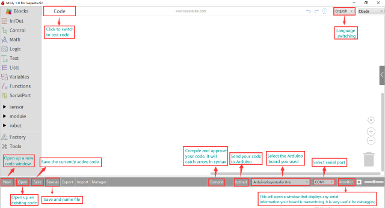

1.  **Keyestudio V4.0 Development Board**

We need to know keyestudio V4.0 development board, as a core of this smart car.

Keyestudio V4.0 development board is an Arduino uno -compatible board, which is
based on ATmega328P MCU, and with a cp2102 Chip as a UART-to-USB converter.

It has 14 digital input/output pins (of which 6 can be used as PWM outputs), 6
analog inputs, a 16 MHz quartz crystal, a USB connection, a power jack, 2 ICSP
headers and a reset button.

It contains everything needed to support the microcontroller; simply connect it
to a computer with a USB cable or power it via an external DC power jack (DC
7-12V) or via female headers Vin/ GND(DC 7-12V) to get started.

| Microcontroller             | ATmega328P-PU                                            |
|-----------------------------|----------------------------------------------------------|
| Operating Voltage           | 5V                                                       |
| Input Voltage (recommended) | DC7-12V                                                  |
| Digital I/O Pins            | 14 (D0-D13)  (of which 6 provide PWM output)             |
| PWM Digital I/O Pins        | 6 (D3, D5, D6, D9, D10, D11)                             |
| Analog Input Pins           | 6 (A0-A5)                                                |
| DC Current per I/O Pin      | 20 mA                                                    |
| DC Current for 3.3V Pin     | 50 mA                                                    |
| Flash Memory                | 32 KB (ATmega328P-PU) of which 0.5 KB used by bootloader |
| SRAM                        | 2 KB (ATmega328P-PU)                                     |
| EEPROM                      | 1 KB (ATmega328P-PU)                                     |
| Clock Speed                 | 16 MHz                                                   |
| LED_BUILTIN                 | D13                                                      |

1.  **Installing V4.0 board Driver**

Let’s install the driver of keyestudio V4.0 board. The USB-TTL chip on V4.0
board adopts CP2102 serial chip. The driver program of this chip is included in
Arduino 1.8 version and above, which is convenient. Plug on USB port of board,
the computer can recognize the hardware and automatically install the driver of
CP2102.

If install unsuccessfully, or you intend to install manually, open the device
manager of computer. Right click Computer----- Properties----- Device Manager

There is a yellow exclamation mark on the page, which implies installing
unsuccessfully. Then we double click the hardware and update the driver.

Click “OK” to enter the following page, click “browse my computer for updated
driver software”, find out the installed or downloaded ARDUINO software. As
shown below:

There is a DRIVERS folder in Arduino software installed
package, open driver folder
and you can see the driver of CP210X series chips.

We click “Browse”, then find out the driver folder, or you could enter “driver”
to search in rectangular box, then click “next”, the driver will be installed
successfully. (I place Arduino software folder on the desktop, you could follow
my way)

Open device manager, we will find the yellow exclamation mark disappear. The
driver of CP2102 is installed successfully.

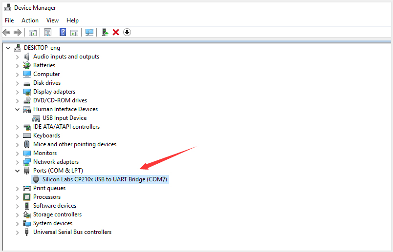

1.  **Start the first program**

Click “Open”→ sample → arduino→ Arduino → 01 IN-OUT→01-LED Blink.mix

The corresponding board and COM port will be shown after setting board and COM
port.

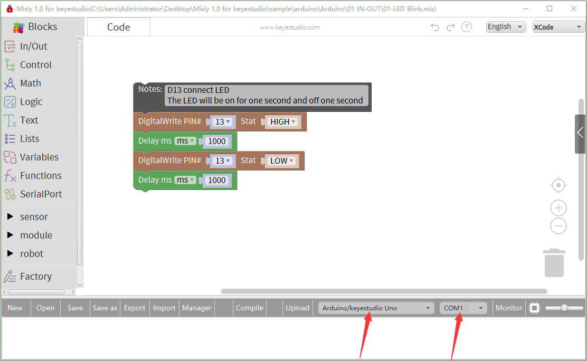

Click **Compile** to start compiling the program, check errors.

Click **Upload** to upload the program, upload successfully.

After uploading the program successfully, the onboard LED lights up for 1s,
lights off for 1s. Congratulation, you finish the first program.

## 6.Projects:

The whole project begins with basic program. Starting from simple to complex,
the lessons will guide you to assemble robot car and absorb the knowledge of
electronic and machinery step by step. I reckon that you could hardly sit still
and itch to have a go, let’s get started.

**If you want to go directly to the step of installing the robot, please click this link**

[assembly-guide](https://ks0470-4wd-bt-multi-purpose-robot-car-v20-kit-for-mixly.readthedocs.io/en/latest/KS0470_Mixly.html#assembly-guide)

Note: (G), marked on each sensor and module, implies negative pole, which is
connected to “G”, ”-”or “GND”on the sensor shield and control board ; (V)
represents positive pole, which is linked with V , VCC, + or 5V on the sensor
shield and control board.

### Project 1: LED Blink

1.  **Description**

For the starter and enthusiast, this is a fundamental program---LED Blink.

LED, the abbreviation of light emitting diodes, consist of Ga, As, P, N chemical
compound and so on. The LED can flash diverse color by altering the delay time
in the test code. When in control, power on GND and VCC, the LED will be on if S
end is high level; nevertheless, it will go off.

1.  **Specification**

Control interface: digital port

Working voltage: DC 3.3-5V

Pin spacing: 2.54mm

LED display color: red

**(3) Components**

**(4) Wiring Diagram**

The expansion board is stacked on development board, - of LED module is
connected to G of shield, “+”is linked with 5V, S end is attached to D3.

1.  **Test Code：**

The program will be generated if you find the following file and drag it into
Mixly software.

| File Type | Route                                               | File Name            |
|-----------|-----------------------------------------------------|----------------------|
| MIX File  | ../tutorial for Mixly/Mixly Code/lesson_1_LED Blink | lesson_1.1_LED Blink |

You could edit code step by step as follows:

1.  Enter “Control” to get block

2.  Click “Sensor” →
    “ControlOutput”→，and combine
    it with block，

3.  S end of red LED is connected D3 of sensor shield, click the drop-down
    triangle button to set PIN 3 and LOW.

1.  Copy
    blockonce，and set to HIGH

1.  Click “Control” to drag out
    block

1.  Duplicate code
    stringonce，and set to LOW.

Complete Program：

**(6) Test Result：**

Upload the program, LED flickers with the interval of 1s.

1.  **Extension Practice：**

We succeed to blink LED. Next, let’s observe what LED will change if we modify
pins and delay time.

The program will be generated if you find the following file and drag it into
Mixly software.

| File Type | Route                                               | File Name                     |
|-----------|-----------------------------------------------------|-------------------------------|
| MIX File  | ../tutorial for Mixly/Mixly Code/lesson_2_LED blink | lesson_1.2_Extension Practice |

You could edit code step by step as follows:

Complete Program：

The LED flickers faster through the test result, therefore, pins and delay time
affect flash frequency.

### Project 2: Adjust LED Brightness

1.  **Description**

In previous lesson, we control LED on and off and make it blink.

In this project, we will control LED brightness through PWM to simulate
breathing effect. Similarly, you can change the step length and delay time in
the code so as to demonstrate different breathing effect.

PWM is a means of controlling the analog output via digital means. Digital
control is used to generate square waves with different duty cycles (a signal
that constantly switches between high and low levels) to control the analog
output.In general, the input voltage of port are 0V and 5V. What if the 3V is
required? Or what if switch among 1V, 3V and 3.5V? We can’t change resistor
constantly. For this situation, we need to control by PWM.

For the Arduino digital port voltage output, there are only LOW and HIGH, which
correspond to the voltage output of 0V and 5V. You can define LOW as 0 and HIGH
as 1, and let the Arduino output five hundred 0 or 1 signals within 1 second.

If output five hundred 1, that is 5V; if all of which is 1, that is 0V. If
output 010101010101 in this way then the output port is 2.5V, which is like
showing movie. The movie we watch are not completely continuous. It actually
outputs 25 pictures per second. In this case, the human can’t tell it, neither
does PWM. If want different voltage, need to control the ratio of 0 and 1. The
more 0,1 signals output per unit time, the more accurately control.

PWM is a technology to obtain analog quantity through digital method. Digital
control forms a square wave, and the square wave signal only has two states of
turning on and off (that is, high or low levels). By controlling the ratio of
the duration of turning on and off, a voltage varying from 0 to 5V can be
simulated. The time turning on(academically referred to as high level) is called
pulse width, so PWM is also called pulse width modulation.

Through the following five square waves, let’s acknowledge more about PWM.

In the above figure, the green line represents a period, and value of
analogWrite() corresponds to a percentage which is called Duty Cycle as well.
Duty cycle implies that high-level duration is divided by low-level duration in
a cycle. From top to bottom, the duty cycle of first square wave is 0% and its
corresponding value is 0. The LED brightness is lowest, that is, turn off. The
more time high level lasts, the brighter the LED. Therefore, the last duty cycle
is 100%, which correspond to 255, LED is brightest. 25% means darker.

PWM mostly is used for adjusting the LED brightness or rotation speed of motor.

It plays vital role in controlling smart robot car. I believe that you can’t
wait to enter next project.

**(2) Components**

**(3) Test Code：**

The program will be generated if you find the following file and drag it into
Mixly software.

| File Type | Route                                                           | File Name                        |
|-----------|-----------------------------------------------------------------|----------------------------------|
| MIX File  | ../tutorial for Mixly/Mixly Code/lesson_2_Adjust LED Brightness | lesson_2.1_Adjust LED Brightness |

You could edit code step by step as follows:

1.  Click “Control” to get block

2.  Go
    to“sensor”→“ControlOutput”→，

3.  Red LED is connected to D3, so set to PIN 3 and LOW

(4) Enter“Control”to get
block，set block:

(5) Enter “In/Out” to get
block，

(6) Click “Variables” to move
blockinto 0 box behind value.

(7) Click ”Control”to move
blockinto
block，delay in 5ms.

1.  Copy code
    stringonce，set code
    string
    as follows: 

Complete Program：

1.  **Test Result：**

Upload test code successfully, LED gradually becomes brighter then darker, like
human breath, rather than light on and off immediately.

1.  **Extension Practice：**

The program will be generated if you find the following file and drag it into
Mixly software.

| File Type | Route                                                            | File Name                      |
|-----------|------------------------------------------------------------------|--------------------------------|
| MIX File  | ../tutorial for Mixly/Mixly Code/lesson_2_Adjust LED Brightness  | lesson_2.2_Extension Practice  |

You could edit code step by step as follows:

Complete Program：

Upload code on the development board and the time interval of LED getting dark
is longer.

### Project 3: Line Tracking Sensor

**(1) Description：**

The tracking sensor is
actually an infrared sensor. The component used here is the TCRT5000 infrared
tube.

Its working principle is to use the different reflectivity of infrared light to
the color, then convert the strength of the reflected signal into a current
signal.

During the process of detection, black is active at HIGH level, but white is
active at LOW level. The detection height is 0-3 cm.

Keyestudio 3-channel line tracking module has integrated 3 sets of TCRT5000
infrared tube on a single board, which is more convenient for wiring and
control.

By rotating the adjustable potentiometer on the sensor, it can adjust the
detection sensitivity of the sensor.

**(2) Specification：**

-   Operating Voltage: 3.3-5V (DC)

-   Interface: 5PIN

-   Output Signal: Digital signal

-   Detection Height: 0-3 cm

Special note: before testing, turn the potentiometer on the sensor to adjust the
detection sensitivity. When adjust the LED at the threshold between ON and OFF,
the sensitivity is the best.

1.  **Equipment：**

1.  **Connection Diagram：**

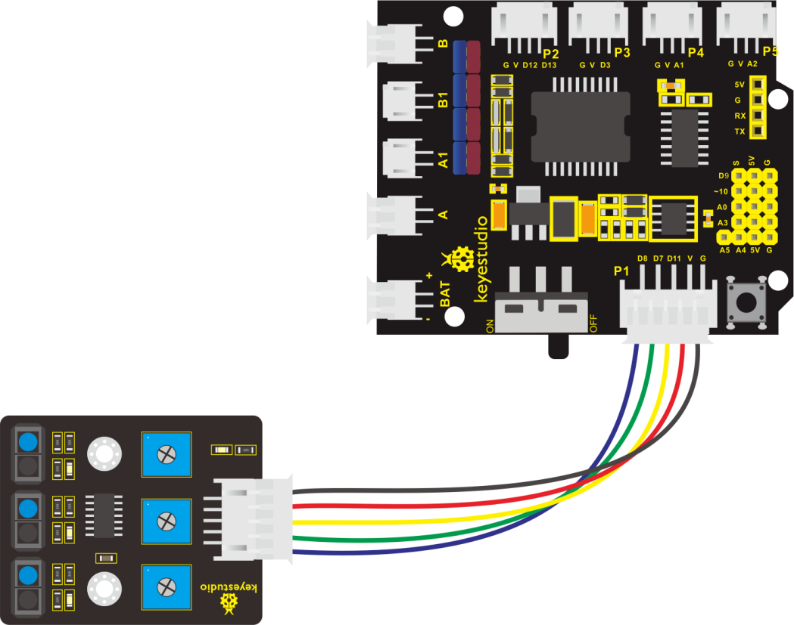

1.  **Test Code：**

The program will be generated if you find the following file and drag it into
Mixly software.

| File Type | Route                                                          | File Name                       |
|-----------|----------------------------------------------------------------|---------------------------------|
| MIX File  | ../tutorial for Mixly/Mixly Code/lesson_3_Line Tracking Sensor | lesson_3.1_Line Tracking Sensor |

You could edit code step by step as follows:

1.  Click “Control” to get block

2.  Enter “Serial port” to move
    blockblock.

(3) Go to “Variables” to moveinto
blockfor three times；then enter
“Math” to drag block and copy it
for 3 times.

(4) Combine with
block, and separately set to
val_L, val_M and val_R.

(5) Enter “Variables” to move out
block，

1.  Go to “Sensor” → “DigitalRead”
    →

2.  Integrate
    blockblock.

3.  The line tracking sensor is linked with D6, so set to PIN 11.

4.  Replicate
    blocktwice，and separately
    change val_L into val_M and val_R;

5.  The tracking sensor is also connected to D7 and D8, therefore, set to PIN 7
    and PIN 8

1.  Click “Serial Port”to drag out
    block，and go to “Text” to
    move blockinto
    block，

2.  Change hello into
    left：

3.  Copy blockagain，and
    enter“Variables”to move
    block.

4.  Replicate code once and
    delete left：， as shown below:

1.  Duplicate code
    stringonce，and change
    left：into middle : , val_L into val_M.

2.  Copy block，and alter
    left：into right：

3.  Go to“Serial Port”to drag
    outblock ，and enter
    “Variables” to drag into
    block.

1.  Enter “Control” to get block,
    and delay in 500ms.

Complete Program：

1.  **Test Result：**

Upload the code on development board, open serial monitor to check line tracking
sensors. And the displayed value is 1(high level) when no signals are received.
The value becomes int o 0 when covering sensor with paper.

1.  **Extension Practice：**

After knowing its working principle, connect an LED to D9. We could control LED
by line tracking sensor.

The program will be generated if you find the following file and drag it into
Mixly software.

| File Type | Route                                                          | File Name                     |
|-----------|----------------------------------------------------------------|-------------------------------|
| MIX File  | ../tutorial for Mixly/Mixly Code/lesson_3_Line Tracking Sensor | lesson_3.1_Extension Practice |

You could edit code step by step as follows:

(1) Click “Control” to get block

(2) Enter “Serial Port” to move
block

1.  Go to “Variables” to drag out
    blockand copy it twice

2.  Separately change item into val_L, val_M and val_R.

3.  Go to “Math” to move out
    blockand replicate it twice.

Edit code string as follows:

1.  Go to “Variables” to drag out
    block，

2.  Then click “Sensor” → “DigitalRead”
    

3.  Move
    blockblock，

4.  The line tracking sensor is linked with D6, so set to PIN 11.

5.  Replicate
    blocktwice，and separately
    change val_L into val_M and val_R;

6.  The tracking sensor is also connected to D7 and D8, therefore, set to PIN 7
    and PIN 8

1.  Click “Serial Port” to drag out
    block，and go to “Text” to
    move blockinto
    block，

2.  Change hello into
    left：

3.  Copy blockagain，and
    enter“Variables”to move
    block.

4.  Replicate code once and
    delete left：， as shown below:

1.  Duplicate code
    stringonce，and change
    left：into middle : , val_L into val_M.

2.  Copy block，and alter
    left：into right：

3.  Go to“Serial Port”to drag
    outblock ，and enter
    “Variables” to drag into
    block.

1.  Enter“Control”to move out
    blockto
    move
    blockblock
    turns into.

2.  Go to “Logic” to move
    blockinto if block.

3.  Enter “Variables” to drag
    blockinto the left box of
    block“=”，click “Math” to move
    blockinto right box
    of“=”，and change 0 into 1.

1.  Go to “sensor” → “ControlOutput”
    →

2.  Place it into do block，and set to LOW

3.  LED is linked with D3，therefore, set to PIN 9.

4.  Copy
    blockagain and keep it into
    else

5.  Then set to HIGH, click ”Control” to move out
    block，and delay in 2000ms.

(27) Replicate code
stringtwice，and
respectively
set to val_M and val_R.

Complete Program：

Upload the code to development board, we could see LED light up when covering
the line tracking sensor by hand.

### Project 4: Servo Control

1.  **Description**

Servo motor is a position control rotary actuator. It mainly consists of
housing, circuit board, core-less motor, gear and position sensor. Its working
principle is that the servo receives the signal sent by MCU or receiver and
produces a reference signal with a period of 20ms and width of 1.5ms, then
compares the acquired DC bias voltage to the voltage of the potentiometer and
obtain the voltage difference output.

When the motor speed is constant, the potentiometer is driven to rotate through
the cascade reduction gear, which leads that the voltage difference is 0, and
the motor stops rotating. Generally, the angle range of servo rotation is 0°
\--180 °

The rotation angle of servo motor is controlled by regulating the duty cycle of
PWM (Pulse-Width Modulation) signal. The standard cycle of PWM signal is 20ms
(50Hz). Theoretically, the width is distributed between 1ms-2ms, but in fact,
it's between 0.5ms-2.5ms. The width corresponds the rotation angle from 0° to
180°. But note that for different brand motor, the same signal may have
different rotation angle.

The corresponding servo angles are shown below:

1.  **Specification**

Working voltage: DC 4.8V \~ 6V

Operating angle range: about 180 ° (at 500 → 2500 μsec)

Pulse width range: 500 → 2500 μsec

No-load speed: 0.12 ± 0.01 sec / 60 (DC 4.8V) 0.1 ± 0.01 sec / 60 (DC 6V)

No-load current: 200 ± 20mA (DC 4.8V) 220 ± 20mA (DC 6V)

Stopping torque: 1.3 ± 0.01kg · cm (DC 4.8V) 1.5 ± 0.1kg · cm (DC 6V)

Stop current: ≦ 850mA (DC 4.8V) ≦ 1000mA (DC 6V)

Standby current: 3 ± 1mA (DC 4.8V) 4 ± 1mA (DC 6V)

1.  **Equipment：**

1.  **Wiring Diagram：**

Wiring note: the brown line of servo is linked with Gnd(G), the red line is
connected to 5v(V) and orange line is attached to digital 10.

The servo has to be connected to external power due to its high demand for
driving servo current. Generally, the current of development board is not
enough. If without connected power, the development board could be burnt.

1.  **Test Code：**

The program will be generated if you find the following file and drag it into
Mixly software.

| File Type | Route                                                   | File Name              |
|-----------|---------------------------------------------------------|------------------------|
| MIX File  | ../tutorial for Mixly/Mixly Code/lesson_4_Servo Control | lesson_4_Servo Control |

You could edit code step by step as follows:

1.  Go to“Control”to get block

2.  Enter “Module”→“Drive_Module”to get
    blockand place it into
    block，

3.  The servo is linked with D10, so set to PIN 10.

4.  Set servo to 90°，and delay in 500ms.

1.  Replicate code string for
    three times，respectively change 90 into 0, 180 and 0

Complete Program：

1.  **Test Result：**

Upload code successfully and power on, servo swings in the range of 0° to 180°.

### Project 5: Ultrasonic Sensor

1.  **Description**

The HC-SR04 ultrasonic sensor uses sonar to determine distance to an object like
bats do. It offers excellent non-contact range detection with high accuracy and
stable readings in an easy-to-use package. It comes complete with ultrasonic
transmitter and receiver modules.

The HC-SR04 or the ultrasonic sensor is being used in a wide range of
electronics projects for creating obstacle detection and distance measuring
application as well as various other applications. Here we have brought the
simple method to measure the distance with arduino and ultrasonic sensor and how
to use ultrasonic sensor wit h arduino.

1.  **Specification**

Power Supply :+5V DC

Quiescent Current : \<2mA

Working Current: 15mA

Effectual Angle: \<15°

Ranging Distance : 2cm – 400 cm

Resolution : 0.3 cm

Measuring Angle: 30 degree

Trigger Input Pulse width: 10uS

1.  **Equipment：**

1.  **Ultrasonic Sensor**

As the above picture shown, it is like two eyes. One is transmitting end, the
other is receiving end.

The ultrasonic module will emit the ultrasonic waves after trigger signal. When
the ultrasonic waves encounter the object and are reflected back, the module
outputs an echo signal, so it can determine the distance of object from the time
difference between trigger signal and echo signal.

The t is the time that emitting signal meets obstacle and returns.

and the propagation speed of sound in the air is about 343m/s, therefore,
distance = speed \* time, because the ultrasonic wave emits and comes back,
which is 2 times of distance, so it needs to be divided by 2, the distance
measured by ultrasonic wave = (speed \* time)/2

1.  Use method and timing chart of ultrasonic module:

2.  Setting the delay time of Trig pin of SR04 to 10μs at least, which can
    trigger it to detect distance.

3.  2\. After triggering, the module will automatically send eight 40KHz
    ultrasonic pulses and detect whether there is a signal return. This step
    will be completed automatically by the module.

4.  3\. If the signal returns, the Echo pin will output a high level, and the
    duration of the high level is the time from the transmission of the
    ultrasonic wave to the return.

Circuit diagram of ultrasonic sensor:

1.  **Hook-up Diagram：**

Wiring guide:

Ultrasonic sensor keyestudio V5 sensor shield

VCC → 5v(V)

Trig → 12(S)

Echo → 13(S)

Gnd → Gnd(G)

1.  **Test Code：**

The program will be generated if you find the following file and drag it into
Mixly software.

| File Type | Route                                                        | File Name                     |
|-----------|--------------------------------------------------------------|-------------------------------|
| MIX File  | ../tutorial for Mixly/Mixly Code/lesson_5_Ultrasonic Sensor  | lesson_5.1_Ultrasonic Sensor  |

You could edit code step by step as follows:

(1) Click “Control” Module to get
block.

(2) Enter “Serial Port” to move
blockblock.

(3) Go to “Variables” to get
blockand copy it twice.
Respectively change item into distance 1 and distance 2.

(4) Click “Math” to move out
blockand replicate it twice.

(5) Click “Variables” to drag out
block，and enter “sensor” →
“OtherSensor” →.

(6) Combine block with block
，

Trig pin of ultrasonic sensor is connected to D12(S) of shield，Echo is attached
to D13(S)，so set Trig 12 and Echo 13.

1.  Click “Variables” to get
    block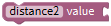，and drag
    out from “Math” and keep it
    behind block.

2.  Go to “Variables” to move out
    blockleft 1 box“.

3.  Then change another 1 into 0.3937，and set to “×”.

1.  Go to “Serial Port ” to drag out
    block，and click “Variables”
    to get block.

(11) Combine  with

(12) Go to “Serial Port” to get
block，then click “Text” module
to drag
block中，and
change hello into in.

1.  Copy code stringonce，change
    distance2 into distance1，in into cm

1.  Click “Control” to get
    block，delay in 50ms.

Complete Program：

1.  **Test Result：**

Upload test code on the development board, open serial monitor and set baud rate
to 9600. The detected distance will be displayed, unit is cm and inch. Hinder
the ultrasonic sensor by hand, the displayed distance value gets smaller.

1.  **Extension Practice：**

We have measured the distance displayed by ultrasonic sensor. How about
controlling the LED with the measured distance? Let's try it, connect an LED
light module to the D3 pin.

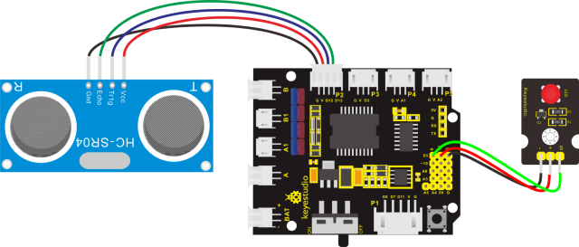

The program will be generated if you find the following file and drag it into
Mixly software.

| File Type | Route                                                        | File Name                     |
|-----------|--------------------------------------------------------------|-------------------------------|
| MIX File  | ../tutorial for Mixly/Mixly Code/lesson_5_Ultrasonic Sensor  | lesson_5.2_Extension Practice |

You could edit code step by step as follows:

(1) Enter “Control” to get block

(2) Click “Serial Port” to drag out
block

(3) Go to “Variables” to move out
blockand copy it twice.

(4) Enter “Math” to drag out
blockand replicate twice, and
change item into distance 1 and distance 2.

(5) Edit the code string as follows:

(6) Go to “Variables” to move
outblock，then click“sensor”→
“OtherSensor” →

(7) Combine it with block，the
pin Trig of ultrasonic sensor is linked with D12(S) of expansion board, pin Echo
is attached to D13(S); therefore, click the triangle button to select 12 and 13.

(8) Click “Variables” to get
block，and drag
out from “Math” and keep it
behind block.

1.  Go to “Variables” to move out
    blockleft 1 box“.

2.  Then change another 1 into 0.3937，and set to “×”.

1.  Go to “Serial Port ” to drag out
    block，and click “Variables”
    to get block.

2.  Combine  with
    

1.  Go to “Serial Port” to get
    block，then click “Text”
    module to drag
    block中，and
    change hello into in.

1.  Replicate code string
    once，and change distance2
    into distance1，and in into cm.

1.  Go to“Control”to move out
    blockand delay in 50ms

1.  Click “Control” and drag it into
    blockand
    movethen
    we get block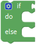.

2.  Go to “Logic” to get  and
    .

3.  Place into if block，and
    leave  in the left box of
    block.

4.  Enter “Variables” to get
    block and keep it at left box
    of block “=”.

5.  Go to “Math” to move outinto
    right box of block “=”，and change 0 into 2, “=” into “≥”.

6.  Replicate blockonce and set
    

1.  Click “sensor”
    →“ControlOutput”→and place it
    into do block，

2.  The S end of LED Module is connected to D3 of expansion board，therefore,
    click the triangle button to select 9.

3.  Replicate
    blockonce and leave it into
    “else” and set to LOW.

Complete Program：

Upload test code to development board and block ultrasonic sensor by hand, then
check if LED is on

### Project 6: IR Reception**

1.  **Description**

There is no doubt that infrared remote control is ubiquitous in daily life. It
is used to control various household appliances, such as TVs, stereos, video
recorders and satellite signal receivers. Infrared remote control is composed of
infrared transmitting and infrared receiving systems, that is, an infrared
remote control and infrared receiving module and a single-chip microcomputer
capable of decoding.​

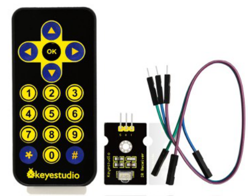The 38K infrared carrier signal
emitted by remote controller is encoded by the encoding chip in the remote
controller. It is composed of a section of pilot code, user code, user inverse
code, data code, and data inverse code. The time interval of the pulse is used
to distinguish whether it is a 0 or 1 signal and the encoding is made up of
these 0, 1 signals.

The user code of the same remote control is unchanged. The data code can
distinguish the key.

When the remote control button is pressed, the remote control sends out an
infrared carrier signal. When the IR receiver receives the signal, the program
will decode the carrier signal and determines which key is pressed. The MCU
decodes the received 01 signal, thereby judging what key is pressed by the
remote control.

Infrared receiver we use is an infrared receiver module. Mainly composed of an
infrared receiver head, it is a device that integrates reception, amplification,
and demodulation. Its internal IC has completed demodulation, and can achieve
from infrared reception to output and be compatible with TTL signals.
Additionally, it is suitable for infrared remote control and infrared data
transmission. The infrared receiving module made by the receiver has only three
pins, signal line, VCC and GND. It is very convenient to communicate with
arduino and other microcontrollers.

1.  **Specification**

Operating Voltage: 3.3-5V（DC）

Interface: 3PIN

Output Signal: Digital signal

Receiving Angle: 90 degrees

Frequency: 38khz

Receiving Distance: 10m

1.  **Equipment：**

1.  **Connection Diagram**

Respectively link “-”, “+” and S of IR receiver module with G(GND）, V（VCC）and
A0 of keyestudio development board.

Attention: On the condition that digital ports are not available, analog ports
can be regarded as digital ports. A0 equals to D14, A1 is equivalent to digital
15.

1.  **Test Code：**

The program will be generated if you find the following file and drag it into
Mixly software.

| File Type | Route                                                  | File Name               |
|-----------|--------------------------------------------------------|-------------------------|
| MIX File  | ../tutorial for Mixly/Mixly Code/lesson_6_IR Reception | lesson_6.1_IR Reception |

You could edit code step by step as follows:

(1) Enter “Control” Module to get
block.

(2) Click“Serial Port”Module to drag
blockblock

(3) Go to
“Module”→”Communicate_Module”→，

(4) Signal end of IR receiver module is connected to A0 of shield, therefore,
click triangle button to select 3.

(5) Click “Control” Module，to
moveout, delay in 100ms

Complete Program：

1.  Test Result：

Upload test code, open serial monitor and set baud rate to 9600, point remote
control to IR receiver and the corresponding value will be shown, if pressing so
long, the error codes will appear

Below we have listed out each button value of keyestudio remote control. So you
can keep it for reference.

1.  **Extension Practice:**

We decoded the key value of IR remote control. How about controlling LED by the
measured value? We could operate an experiment to affirm. Attach an LED to D3,
then press the keys of remote control to make LED light up and off.

The program will be generated if you find the following file and drag it into
Mixly software.

| File Type | Route                                                  | File Name                     |
|-----------|--------------------------------------------------------|-------------------------------|
| MIX File  | ../tutorial for Mixly/Mixly Code/lesson_6_IR Reception | lesson_6.2_Extension Practice |

You could edit code step by step as follows:

(1) Enter “Control” Module to get
block

(2) Go to “Serial Port” to move out
blockinto
block.

(3) Go
to“Module”→“Communicate_Module”→，

(4) S end of IR receiver module is linked with 3. therefore, click triangle
button to set A0.

1.  Go to “Variables” to move
    blockinto
    block，(6) Go to“Math”to drag
    out blockand integrate with
    , then change item into a.

(7) Click “Control”module to get
blockturns
intoblock.

(8) Go to “Logic”，and find out
block. Leave it behind if block

(9) Go to “Logic” to placein the
left box.

(10) Click “Variables” to move in
the left box of “=” block，go to “Math” to drag
outinto right box of “=”，then
change 0 into 0xFF02FD.

Copyonce and keep it into right
box of ”and” block，change ir_item into a，0xFF02FD into 0.

(11) Click “sensor”→
“ControlOutput”→

(12) Keep it into the first do block，S end of red LED module is linked with D3
of expansion board，and set to Pin 3.

(13) Go to “Variables” to move
below “Red_LED...HIGH” block.

(14) Click “Math” to get block
into，and change 0 into 1.

1.  Replicate once and move into
    “else if” ，change 0 into 1.

1.  Replicate code
    stringonce and place it into
    second do block.

2.  Click “HIGH” into “LOW”，1 into 0.

Complete Program：

Upload code to development board, press “OK” key on remote control to make LED
on and off.

### Project 7: Bluetooth Remote Control

1.  **Description：**

Bluetooth, a simple wireless communication module most popular since the last
few decades and easy to use are being used in most of the battery-powered
devices.

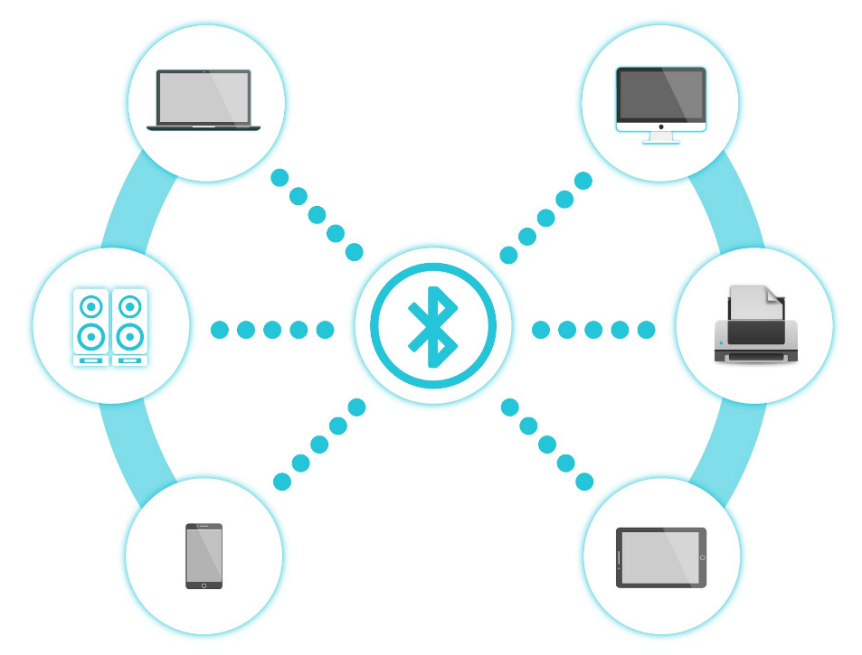Over the years, there have been
many upgrades of Bluetooth standard to keep fulfil the demand of customers and
technology according to the need of time and situation.

Over the few years, there are many things changed including data transmission
rate, power consumption with wearable and IoT Devices and Security System.

Here we are going to learn about HM-10 BLE 4.0 with Arduino Board. The HM-10 is
a readily available Bluetooth 4.0 module. This module is used for establishing
wireless data communication. The module is designed by using the Texas
Instruments CC2540 or CC2541 Bluetooth low energy (BLE) System on Chip (SoC).

1.  **Parameters:**

Bluetooth protocol: Bluetooth Specification V4.0 BLE

No byte limit in serial port Transceiving

In open environment, realize 100m ultra-distance communication with iphone4s

Working frequency: 2.4GHz ISM band

Modulation method: GFSK(Gaussian Frequency Shift Keying)

Transmission power: -23dbm, -6dbm, 0dbm, 6dbm, can be modified by AT command.

Sensitivity: ≤-84dBm at 0.1% BER

Transmission rate: Asynchronous: 6K bytes ; Synchronous: 6k Bytes

Security feature: Authentication and encryption

Supporting service: Central & Peripheral UUID FFE0, FFE1

Power consumption: Auto sleep mode, stand by current 400uA\~800uA, 8.5mA during
transmission.

Power supply: 5V DC

Working temperature: –5 to +65 Centigrade

1.  **Equipment：**

1.  **Hook-up diagram：**

**1. STATE:** *state test pins, connected to internal LED, generally keep it
unconnected.*

**2. RXD:** *serial interface, receiving terminal.*

**3. TXD:** *serial interface, transmitting terminal.*

**4. GND:** *Ground.*

**5. VCC:** *positive pole of the power source.*

**6. EN/BRK:** *break connect, it means breaking the Bluetooth connection,
generally, keep it unconnected.*

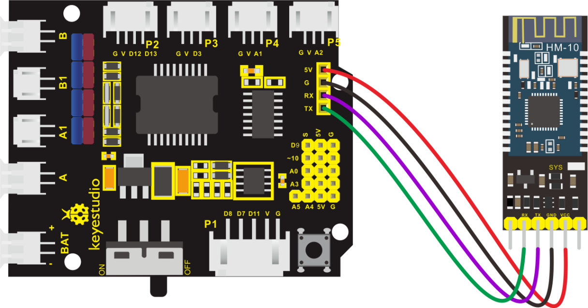

**Pay attention to the pin direction when inserting Bluetooth module, and don’t
insert it before uploading test code**

1.  **Test Code：**

The program will be generated if you find the following file and drag it into
Mixly software.

| File Type | Route                                                              | File Name                            |
|-----------|--------------------------------------------------------------------|--------------------------------------|
| MIX File  | ../tutorial for Mixly/Mixly Code/lesson_7_Bluetooth Remote Control | lesson_7.1_Bluetooth Remote Control  |

You could edit code step by step as follows:

1.  Click “Control”to get block

2.  Enter “Serial Port”to move
    block

1.  Click “Variables” to drag out
    ，enter
    “Math” block to get block.

2.  Place it behind “value”，and change item into ble_val，click the drop-down
    triangle button to select char.

1.  Go to “Control” to get
    block，and click “Serial
    Port” to move out blockinto
    if block.

1.  Enter “Variables” to drag out
    blockinto do block，click
    “Serial Port” to move out block
     into
     block.

1.  Enter “Serial Port” to move
    block into do block，then
    click “Variables” to drag out
    into
    block.

Complete Program：

(There will be contradiction between serial communication of code and
communication of Bluetooth when uploading code, therefore, don’t link with
Bluetooth module before uploading code.)

After uploading code on development board, then insert Bluetooth module, wait
for the command from cellphone.

**(6) Download APP**

The code is the received signal by serial monitor, in this project, we send
signal to control robot car via cellphone.

Then we need to download the APP.

1.  **iOS system**

Enter APP STORE to search **BLE Scanner 4.0, then download it.**

1.  **Android system**

Enter [Google Play](https://developer.android.google.cn/distribute?hl=zh-cn) to
find out **BLE Scanner, then download.**

**(Enable“location”in settings of your cellphone; otherwise, app may not be
searched.)**

1.  After installation, open App and enable“Location and Bluetooth” permission.

1.  Open App, the name of Bluetooth module is HMSoft.

Then click “connect” to link with Bluetooth

1.  After connecting to HMSoft, click it to get multiple options, such as device
    information, access permission, general and custom service. Choose “CUSTOM
    SERVICE”

1.  Then pop up the following page.

7\. Click（Read,Notify,WriteWithoutResponse)to enter the following page

8\. Click **Write Value to enter HEX or Text.**

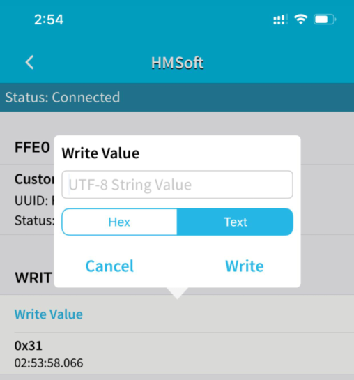

1.  Open the serial monitor on Arduino，enter a 0 or other character on Text
    interface.

1.  Then click “Write”, open serial monitor to view if there is a “0” signal

**(7) Extension Practice：**

We could send a command via Bluetooth to turn on and off a LED.

D3 is connected to a LED, as shown below:

The program will be generated if you find the following file and drag it into
Mixly software.

| File Type | Route                                                                 | File Name                       |
|-----------|-----------------------------------------------------------------------|---------------------------------|
| MIX File  | ../tutorial for Mixly/Mixly Code/lesson_7\_ Bluetooth Remote Control  | lesson_7.2\_ Extension Practice |

You could edit code step by step as follows:

1.  Click “Control” to get block

2.  Enter “Serial Port”to move
    block

3.  Click “Variables” to move
    blockinto
    block，then go to “Math” to
    find out，

4.  Combine
    and
    change item into i.

1.  Click “Control” to get
    block，and enter “Serial
    port”to moveinto if block.

1.  Go to “Variables” to drag
    blockinto do block，

2.  enter “Serial port” to move
    outblock and edit code string
    as follows:

1.  Enter “Serial port” to drag
    out，

2.  Click “Text” to move
    outblock，and
    change “hello” into DATA RECEIVED：.

1.  Click “Control” to move out
    blockinto do，click “Logic”
    to moveblock into if，

2.  Enter “Variables” to move
    into left box of “=”，then
    enter “Text” to get blockand
    leave it into right box“=”，change a into 1.

1.  Enter “Sensor”→
    “ControlOutput”→

2.  Drag it into the second do block，S end of red LED is connected to D3,
    therefore, set to Pin 3.

1.  Replicateonce and place it
    into the second do block. Change DATA RECEIVED：into led on.

1.  Copy code
    stringonce and change 1 into
    0，click “HIGH” to select “LOW”，and change led on into led off.

Complete Program：

Click “Write” on APP, when you enter 1, LED will be on, when you input 0, LED
will be off. (Remember to remove the Bluetooth module after finishing
experiment; otherwise, burning code will be affected)

### Project 8: Motor Driving and Speed Control

1.  **Description**

There are many ways to drive the motor. Our robot car uses the most commonly
used L298P solution. L298P is an excellent high-power motor driver IC produced
by STMicroelectronics. It can directly drive DC motors, two-phase and four-phase
stepping motors. The driving current up to 2A, and output terminal of motor
adopts eight high-speed Schottky diodes as protection.

We designed a shield based on the circuit of L298p.

The stacked design reduces the technical difficulty of using and driving the
motor.

**(2) Specification**

Circuit Diagram for L298P Board

1.  Logic part input voltage: DC5V

2.  Driving part input voltage: DC 7-12V

3.  Logic part working current: \<36mA

4.  Driving part working current: \<2A

5.  Maximum power dissipation: 25W (T=75℃)

6.  Working temperature: -25℃～＋130℃

7.  Control signal input level: high level 2.3V\<Vin\<5V, low level
    \-0.3V\<Vin\<1.5V

**(3) Drive Robot to Move**

The driver of motor driver shield is in parallel connection. You could control
the direction of motors by altering the orientation of jumper caps(seen in the
picture).

Through the above diagram, the direction pin of B motor is D4, and speed pin is
D5; D2 is the direction pin of A motor, D6 is speed pin.

PWM decides 2 motors to rotate so as to drive robot car. The PWM value is in the
range of 0-255, the larger the number, the faster the motor rotates

| **4WD** **Robot** |  **Motor (A)**       | **Motor (B)**        |
|-------------------|----------------------|----------------------|
| Forward           | Rotate clockwise     |                      |
| Backward          | Rotate anticlockwise |                      |
| Rotate to left    | Rotate anticlockwise | Rotate clockwise     |
| Rotate to right   | Rotate clockwise     | Rotate anticlockwise |
| Stop              | Stop                 | Stop                 |

**(4) Equipment：**

**(5) Hook-up Diagram：**

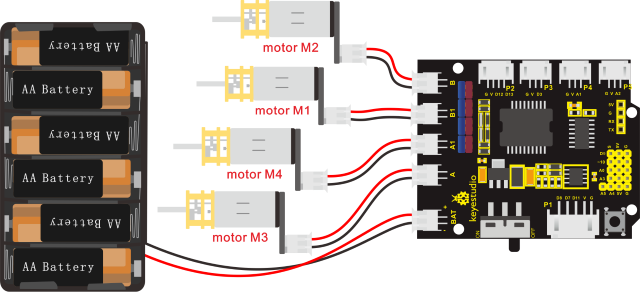

**Attention: connect motors in compliance with the above connection diagram**

1.  **Test Code：**

The program will be generated if you find the following file and drag it into
Mixly software.

| File Type | Route                                                                      | File Name                                    |
|-----------|----------------------------------------------------------------------------|----------------------------------------------|
| MIX File  | ../tutorial for Mixly/Mixly Code/lesson_8_Motor Driving and Speed Control  | lesson_8.1_Motor Driving and Speed Control   |

You could edit code step by step as follows:

(1) Click “Control” to get block.

(2) Go to
”Module”→”Drive_Module”→，

(3) Place it into block，

(4) The direction pin and speed control pin of B motor(left) are connected to D4
and D5. So set PIN 4 and PIN 5 as follows:

(5) Copyonce and place it into
block，

(6) The direction pin and speed control pin of A motor (right) are connected to
D2 and D9. So set PIN 2 and PIN 9 as follows:

1.  Duplicate code string
    once, set INA to HIGH and PWB
    to 200：

1.  Click “Control” to move out
    block，delay in 2000ms.

1.  for
    four times，then set the code string as follows:

Complete Program：

**(7) Test Result:**

Hook up by connection diagram, upload code and power on, smart car goes forward
and back for 2s, turns left and right for 2s, stops for 2s and alternately.

1.  **Extension Practice：**

Adjust the speed that PWM controls the motor, hook up in same way.

The program will be generated if you find the following file and drag it into
Mixly software.

| File Type | Route                                                                     | File Name                     |
|-----------|---------------------------------------------------------------------------|-------------------------------|
| MIX File  | ../tutorial for Mixly/Mixly Code/lesson_8_Motor Driving and Speed Control | lesson_8.2_Extension Practice |

You could edit code step by step.

Complete Program：

Upload code successfully, the motors rotate slower.

### Project 9: 8*16 LED Board

1.  **Description**

If we add a 8\*16 LED board to the robot, it will be amazing. Keyestudio's 8\*16
dot matrix can meet your requirements. You can create facial emoticons, patterns
or other interesting displays yourself. 8\*16 LED light board comes with 128
LEDs. The data of the microprocessor (arduino) communicates with the AiP1640
through the two-wire bus interface, so as to control the 128 LEDs on the module,
which produce the patterns you need on dot matrix. To facilitate wiring, we also
provide a HX-2.54 4Pin wiring.

1.  **Specification**

Working voltage: DC 3.3-5V

Power loss: 400mW

Oscillation frequency: 450KHz

Drive current: 200mA

Working temperature: -40\~80℃

Communication method: two-wire bus

1.  **Equipment：**

**(4) 8\*16 Dot Matrix Display**

Circuit Graph：

**The principle of 8\*16 dot matrix:**

How to control each led light of 8\*16 dot matrix? We know that a byte has 8
bits, each bit is 0 or 1. When a bit is 0, turn off LED and when a bit is 0,
turn on LED. Thereby, one byte can control the LED in a row of dot matrix, so 16
bytes can control 16 columns of led lights, that is, 8\*16 dot matrix.

**Interface Description and Communication Protocol:**

The data of the microprocessor (arduino) communicates with the AiP1640 through
the two-wire bus interface.

The communication protocol diagram is shown below:

(SCLK) is SCL, (DIN) is SDA:

①The starting condition for data input: SCL is high level and SDA changes from
high to low.

②For data command setting, there are methods as shown in the figure below

In our sample program, select the way to **add 1 to the address automatically**,
the binary value is 0100 0000 and the corresponding hexadecimal value is 0x40

③For address command setting, the address can be selected as shown below.

The first 00H is selected in our sample program, and the binary number 1100 0000
corresponds to the hexadecimal 0xc0

④The requirement for data input is that SCL is high level when inputting data,
the signal on SDA must remain unchanged. Only when the clock signal on SCL is
low level, the signal on SDA can be altered. The data input is low-order first,
high-order is behind

⑤ The condition to end data transmission is that when SCL is low, SDA is low,
and when SCL is high, the SDA level also becomes high.

⑥ Display control, set different pulse width, the pulse width can be selected as
shown below

In the example, we choose pulse width 4/16, and the hexadecimal corresponds to
1000 1010 is 0x8A

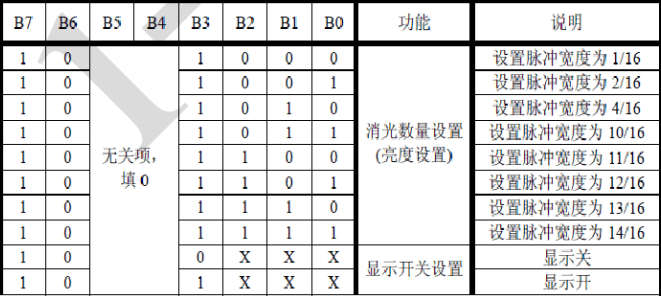

4\. Introduction for Modulus Tool

The online version of dot matrix modulus tool:

[http://dotmatrixtool.com/\#](http://dotmatrixtool.com/)

①Open links to enter the following page.

②The dot matrix is 8\*16 in this project, so set the height to 8, width to 16,
as shown below.

③ Generate hexadecimal data from the pattern

As shown below, press the left mouse button to select, the right button to
cancel, draw the pattern you want, click **Generate**, and the hexadecimal data
we need will be produced.

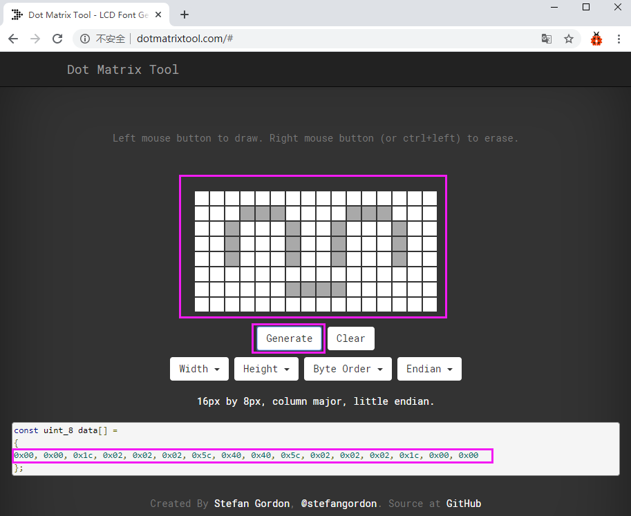

**(5) Connection Diagram**

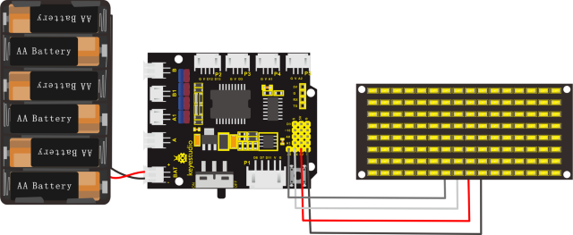

Wiring note: The GND, VCC, SDA, and SCL of the 8\*16 LED panel are respectively
connected to -(GND), + (VCC), A4 and A5 of the keyestudio sensor expansion board
for two-wire serial communication. (Note: This pin is connected to arduino IIC,
but this module is not IIC communication, it can be linked with any two pins.)

**(6) Test Code**

The program will be generated if you find the following file and drag it into
Mixly software.

| File Type | Route                                                    | File Name                   |
|-----------|----------------------------------------------------------|-----------------------------|
| MIX File  | ../tutorial for Mixly/Mixly Code/lesson_8\*16 LED Board  | lesson_9.1_8\*16 LED Board  |

You could edit code step by step as follows:

(1) Click “Control” to get block

(2)Enter“Module”→“Display_Module”→

(3) Leave it into block

(4) Go to “Display_Module” to get
blockand leave it into
block，and click drop-down
triangle button to set “clear”.

(5) Move out block，and set
“”.

Complete Program：

pattern

1.  **Test Result：**

Wire according to connection diagram. The DIP switch is dialed to right end and
power on, the smile face appears on dot matrix.

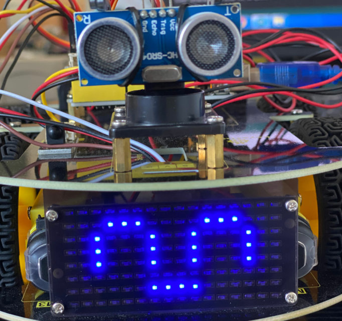

1.  **Extension Practice:**

We use the modulo tool
([http://dotmatrixtool.com/\#](http://dotmatrixtool.com/))to make the dot matrix
alternately display start, forward and stop patterns then clear the patterns.
The time interval is 2000 milliseconds.

Get the graphical code to be displayed via modulus tool

**Start：**

**Go front：**

**Go back：**

**Turn left：**

**Turn right：**

**Stop：**

**Clear:**

Hook-up Diagram：

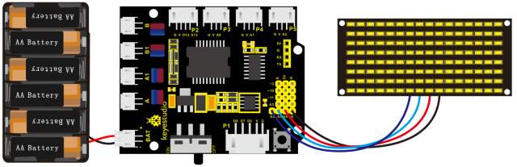

The program will be generated if you find the following file and drag it into
Mixly software.

| File Type | Route                                                    | File Name                     |
|-----------|----------------------------------------------------------|-------------------------------|
| MIX File  | ../tutorial for Mixly/Mixly Code/lesson_9_8×16 LED Board | lesson_9.2_Extension Practice |

You could edit code step by step as follows:

You could edit code step by step as follows:

(1) Click “Control” to get block

1.  Enter “Module” →"Display_Module" to move
    block

1.  Then drag
    block.

2.  Click the drop-down triangle button behind “↑”to select “clear”.

1.  Copy  again, click the
    drop-down triangle button behind “↑” to set “V”.

1.  Click “Control” to get block,
    delay in 2000ms.

1.  Replicate code stringfor
    three times，separately click the triangle button to set “↑”, “STOP” and
    “clear”.

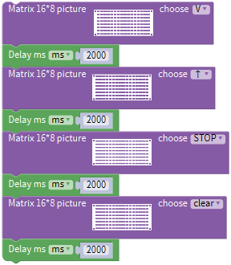

Complete Program：

Upload code on development board, 8\*16 dot matrix displays front and stop
patterns, alternately.

### Project 10: Line Tracking Robot

1.  **Description**

The previous projects are inclusive of the knowledge of multiple sensors and
modules. Next, we will work on a little challenging task.

We could make a line tracking car on top of the working principle of line
tracking sensor.

**Line tracking robot car:**

| Detection | Left tracking sensor | detects black line：HIGH |
|-----------|----------------------|--------------------------|
|           |                      |                          |

detects white line：LOW

Middle tracking sensor

detects black line：HIGH

detects white line：LOW

Right tracking sensor

detects black line：HIGH

detects white line：LOW

Condition 1

Status

Middle tracking sensor detects black line

go front

（PWM set to 70）

Middle tracking sensor detects white line

Status

detecting the left and the right tracking sensor

Condition 2

Status

left tracking sensor detects black line; right sensor detects white line

Rotate to left

（set PWM to 200）

left tracking sensor detects white line; right sensor detects black line

Rotate to right

（ set PWM to 200）

left tracking sensor detects black line; right sensor detects black line

stop

left tracking sensor detects white line; right sensor detects white line

stop

 Flow Chart

**(3) Connection Diagram**

1.  **Test Code**

The program will be generated if you find the following file and drag it into
Mixly software.

| File Type | Route                                                          | File Name                     |
|-----------|----------------------------------------------------------------|-------------------------------|
| MIX File  | ../tutorial for Mixly/Mixly Code/lesson_10_Line Tracking Robot | lesson_10_Line Tracking Robot |

You could edit code step by step as follows:

1.  Go to“Control”Module to find out
    block.

2.  Click“Variables”to move out
    blockand duplicate it for two
    times.

(3) Separately change item into val_L, val_C and val_R.

(4) Go to“Math”to move out
blockand copy it twice.

(5) Edit the following code string:

(6) Go to “Variables” to get
block.

(7) Enter
“robot”→“4wd-SmartCar”→.

(8)

(9) Replicatetwice，then change
val_L into val_C and val_R；left_tracking into center_tracking and
right_tracking.

(10) Click“Control”to get block
，and
moveblock
turns intoblock.

(11) Click“Logic”to move out
blockand place it behind if
block. Go to“Variables”to drag out
blockinto left box of“=”block，

(12) Copyagain and leave it into
right box of“=”b lock，and change 0 into 1.

1.  Enter“robot”→“4wd-SmartCar”→

2.  Place it into do block and set to 70.
    

3.  Go to“Control”to move
    blockinto else
    block，click，drag
    blockblock
    and move
    blockblock
    turns into block.

1.  Enter“Logic”Module to move
    blockinto if block，go
    to“Logic”to drag block into
    left box of “=”.

2.  Go to“Variables” to move
    blockinto left box of
    “=”block，

3.  Enter“Math”to drag blockinto
    right box of“=”block，then change 0 into 1；

4.  Replicate blockonce and keep
    it into right box of “and”block ，

5.  Change val_L into val_R, 1 into 0.

1.  Enter “robot”→”4wd-SmartCar”→

2.  Leave it into second do block, and change 0 into 200.

1.  Duplicate blockonce and keep
    it into else if block. Refer the following code string to edit:

1.  Click“robot”→“4wd-SmartCar”Module，→

2.  Place it into second do block，and change 0 into 200. Then drag
    blockinto second else block.

Complete Program：

1.  **Test Result**

Upload code on the development board, plug in power and turn on the switch of
smart car. The smart turtle car will walk along the black line.

### Project 11: Ultrasonic Follow Robot

**(1) Description**

In this project, we detect the distance value of the obstacle to drive two
motors so as to make robot car move and 8\*8 dot matrix show smile face pattern.

The specific logic of ultrasonic follow robot car is as shown below:

| Detection  | Measured distance of front obstacles | distance（unit：cm） |
|------------|--------------------------------------|----------------------|
| Condition  | Distance＜8                          |                      |
| Status     | Go back（set PWM to 100）            |                      |
| Condition  | distance≥8 and distance＜13          |                      |
| Status     | Stop                                 |                      |
| Condition  | distance≥13 and distance＜35         |                      |
| Status     | Go front（set PWM to 100）           |                      |
| Condition  | distance≥35                          |                      |
| Status     | stop                                 |                      |

**(2) Flow Chart**

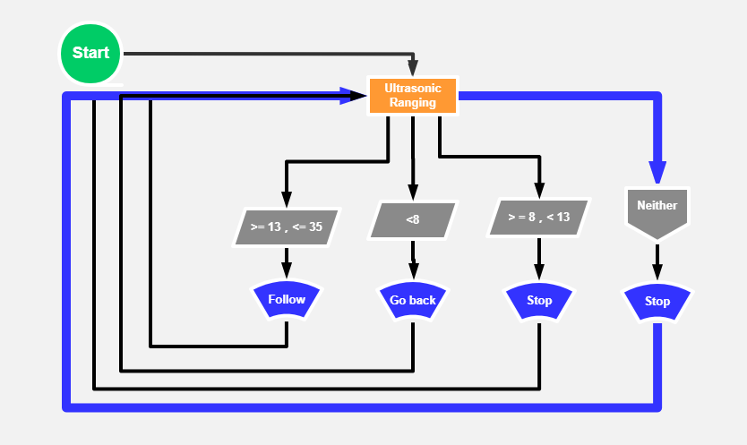

 (3) Connection Diagram

**(4) Test Code**

The program will be generated if you find the following file and drag it into
Mixly software.

| File Type | Route                                                              | File Name                         |
|-----------|--------------------------------------------------------------------|-----------------------------------|
| MIX File  | ../tutorial for Mixly/Mixly Code/lesson_11_Ultrasonic Follow Robot | lesson_11_Ultrasonic Follow Robot |

You could edit code step by step as follows:

1.  Enter “Serial Port”to move
    block

1.  Go to“Variables”to move
    blockinto
    block，enter“Math”to drag
    blockinto
    block，and change item into
    distance. 

2.  Click“Variables”to move out
    block ，

3.  Enter “robot”→“4wd-SmartCar”→

4.  .

5.  Click“Serial Port”to move out
    block，

6.  Enter“Variables”to drag
    outinto
    block.

1.  Click “robot”→“4wd-SmartCar”→

2.  Place it intoblock，and
    change 0 into 90. 

3.  Click “Control” to move out
    blockappears,
    drag into
    blockfor 2 times and move
     into if block, then the
    block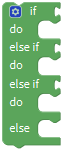is produced.

1.  Enter“Logic”to move block
    into if block

2.  Go to“Variables”to drag
    blockinto left box of “=”

3.  Click “Math”to move out block
    into right box of “=”, change
    0 into 8, and “=”into“\<”.

1.  Enter “robot”→”4wd-SmartCar”→

2.  Leave it into the first do block and set to 100
    

3.  Go to“Logic”to move block
    into else if block.

4.  Replicateblock twice and
    place them into both side of “and” block.

5.  Edit the code string as follows:

1.  Click
    “robot”→“4wd-SmartCar”→，

2.  Leave it into the second do block

1.  Copy block and
     once and place them behind
    the second“else if”block and else block.

1.  Click“4wd-SmartCar”to move out
    blockand leave it into the
    third do block and set to 100.

2.  Set code string as follows: 

Complete Program：

**(5) Test Result**

Upload the code to the development board, plug in power and turn on the switch
of smart car. Robot car will follow the obstacle to move(robot car only moves
forward and backward).

### Project 12: Ultrasonic Avoiding Robot

 Description

We combine the hardware knowledge -- LED matrix, motor drive, ultrasonic and
servo, to build an ultrasonic avoiding robot!

In the circuit process, we can make use of ultrasonic sensor to detect the
distance between robot and front obstacles. Control the motor rotating by
measured data, thus control the robot motion and show the running state by dot
matrix.

The ultrasonic avoiding capability is almost the same as the ultrasonic
following function. We only need to change the source code.

The specific logic of ultrasonic avoiding smart car is as shown below:

| Initial Setup | 8x16 LED Matrix Clear                                      |                                         |                                               |
|---------------|------------------------------------------------------------|-----------------------------------------|-----------------------------------------------|
|               | Set servo to 90°                                           |                                         |                                               |
| Loop program  | measured distance of front obstacle：distance （unit: cm） |                                         |                                               |
|               | Condition 1                                                | State                                   |                                               |
|               |  0\<distance＜10                                           | Smart car stops                         |                                               |
|               |                                                            | 8x16 LED matrix shows “stop” pattern    |                                               |
|               |                                                            | Set the servo to 180°                   | measured distance of obstacle：a1（unit：cm） |
|               |                                                            | Set the servo to 0°                     | measured distance of obstacle：a2（unit：cm） |
|               |                                                            | Condition 2                             | state                                         |
|               |                                                            | a1＜a2                                  | rotate to right（PWM set to 200）             |
|               |                                                            |                                         | 8x16 LED matrix shows “rightward” pattern     |
|               |                                                            |                                         | Set the servo to 90°                          |
|               |                                                            | a1≥a2                                   | rotate to left（PWM set to 200）              |
|               |                                                            |                                         | 8x16 LED matrix shows “leftward” pattern      |
|               |                                                            |                                         | Set servo to 90°                              |
|               | distance≥10                                                | 8x16 LED matrix shows “forward” pattern |                                               |
|               |                                                            | Go front（PWM set to 150）              |                                               |

 Flow Chart

1.  **Wiring Diagram**

1.  **Test Code**

The program will be generated if you find the following file and drag it into
Mixly software.

| File Type | Route                                                                | File Name                           |
|-----------|----------------------------------------------------------------------|-------------------------------------|
| MIX File  | ../tutorial for Mixly/Mixly Code/lesson_12_Ultrasonic Avoiding Robot | lesson_12_Ultrasonic Avoiding Robot |

You could edit code step by step as follows:

1.  Go to “Control” to find out
    block.

2.  Click “Variables” to move out
    blockand duplicate it twice.

(3) Separately change item into distance, a1 and a2.

(4) Go to “Math” to move out
blockand copy it for three times

(5) Edit the following code string:

(6) Enter “robot” → “4wd-SmartCar”
→

(7) Leave it into block，change 0
into 90.

(8) Click“Control”to move
blockinto
block and delay in 300ms.

1.  Click“robot”→“4wd-SmartCar”→

2.  Keep them
    intoblock，click“↑”to
    select“clear”.

1.  Go to“Variables”to move out
    block，then
    enter“4wd-SmartCar”to get
    blockand combine it with
    block.

1.  Click“Control”to move out
    block,
    tap，and
    moveblock
    intoto produce
    bloc.

2.  Go to “Logic” to get  and
    .

3.  Place into if block，and
    leave  in the left box of
    block.

4.  Enter “Variables” to get
    block and keep it at left box
    of block “=”.

5.  Go to “Math” to move outinto
    right box of block “=”, change “=” into“\>”. Replicate
    blockonce and set code string
    as follows:

1.  Click
    “robot”→”4wd-SmartCar”→.

2.  Leave them into block，and
    click“↑”to set“STOP”，then click“Control”to move out
    blockand delay in 100ms.

3.  Place it below

1.  Go to “robot” → “4wd-SmartCar”
    →

2.  Place it into “do” block，change 0 into 180，

3.  Click“Control”to move out
    blockand delay in 500ms.

4.  Keep it into do block.

1.  Replicate code again and
    change distance into a1，then place it into do block

2.  Copy blockand delay in 100ms.

1.  Replicateonce and alter 180
    into 0，a1 into a2.

2.  Finish the code as follows:

1.  Click “Control” and drag it into
    block
    and
    movethen
    we get block.

2.  Go to “Logic” to move out
    blockinto if block，then
    click“Variables”to drag
    blockinto left box
    of“=”block，and move
    blockinto right box
    of“=”，and change“=”into“＞”.

3.  Click
    “robot”→”4wd-SmartCar”→

4.  Place them into block，set to
    200，click “↑” to select “←”.

5.  Change 0 into 90，and drag
    from “Control” into do
    block，delay in 300ms. 

6.  Drag block,
    from“4wd-SmartCar”

7.  Place them into block，set to
    200，click “↑” to choose “→”

8.  And set servo to 90 and move 
    from“Control” and delay in 300ms.

9.  Finish the code as follows:

1.  Click
    “robot”→”4wd-SmartCar”→

2.  Place them into ，and set to
    150.

Complete Program：

1.  **Test Result**

After uploading the code on the keyestudio V4.0 board, wire according to
connection diagram. After the DIP switch is dialed to the right end, the smart
car can automatically avoid obstacles.

### Project 13: IR Remote Control Robot

1.  **Description**

We combine the hardware knowledge -- sensors, motor drive, and IR receiver, to
build an infrared remote control robot car!

In the IR receiver section, we’ve listed out each key value of remote control.
In this circuit design, we can set the key value in the code to navigate the
robot car movement. The corresponding state pattern is displayed on the 8X16 LED
matrix.

 Flow Chart

The specific logic of infrared remote control robot car is shown below:

| Initial setup                                    | 8X16 LED matrix Clear |                                      |
|--------------------------------------------------|-----------------------|--------------------------------------|
| Remote control                                   | Key Value             | Key state                            |
|   | FF629D                | Go front（PWM set to 100）           |
|                                                  |                       | 8\*8 LED matrix shows front icon     |
|   | FFA857                | Back（PWM set to 100）               |
|                                                  |                       | 8\*8 LED matrix shows back icon      |
|   | FF22DD                | Rotate to left（PWM set to 200）     |
|                                                  |                       | 8X16 LED matrix shows leftward icon  |
|   | FFC23D                | Rotate to right（PWM set to 200）    |
|                                                  |                       | 8X16 LED matrix shows rightward icon |
|   |  FF02FD               | Stop                                 |
|                                                  |                       | 8X16 LED matrix shows “STOP”         |

Based on the circuit design, we can start building our own remote control robot.

1.  **Connection Diagram**

1.  **Test Code：**

The program will be generated if you find the following file and drag it into
Mixly software.

| File Type | Route                                                               | File Name                          |
|-----------|---------------------------------------------------------------------|------------------------------------|
| MIX File  | ../tutorial for Mixly/Mixly Code/lesson_13_IR Remote Control Robot  | lesson_13_IR Remote Control Robot  |

You could edit code step by step as follows:

1.  Click “Control” to get block

(2) Enter “Serial Port” to move
block

1.  Click“robot”→”4wd-SmartCar”→

(4) Leave them into block，click
“↑” to select“clear”.

(5) Copyonce and place it
intoblock，and click“clear”to
choose“V”.

(6) Enter
“robot”→“4wd-SmartCar”→

Click“Serial Port”to move
blockblock，

(7) Click“Variables”to drag out
blockinto
block

(8) Click “Control” to move out
blockappears,
drag into
blockfor 5 times，the
blockis produced.

(9) Enter“Variables”to drag
blockinto“switch”block.

(10) Click“Math” to move
blockinto the first case， change
a into 0xFF629D；then go to
”robot”→“4wd-SmartCar”→

Set to 200 and edit the code string as follows:

(11) Click “Math” to drag out
blockinto the second case，and
change a into 0xFFA857；

(12) Go to“4wd-SmartCar”to move out
blockand

(13) Set to 200 and click “↑” to select “↓”

(14) Finish the code string as follows:

(15) Click “Math” to drag
blockinto the third case， and
change a into 0xFF22DD；enter
“Robot”→”4wd-SmartCar”

1.  Place them into the third case, set to 200 and click “↑” to choose “←”

1.  Click “Math” to move
    blockinto the fourth
    case，and change a into 0xFFC23D；

2.  Go
    to“robot”→“4wd-SmartCar”→

3.  Leave them into the fourth “case”，and set to 200. Click“↑”to select“→”.

1.  Go to “Math” to move
    blockinto the fifth “case”,
    and alter a into 0xFF02FD；

2.  Click“robot”→”4wd-SmartCar”→

3.  Keep them into the fifth “case”block，and click “↑” to set “STOP” .

Complete Program：

1.  **Test Result：**

After uploading the code successfully on the keyestudio V4.0 board, wire
according to the connection diagram, after DIP switch is dialed to the right
end, we can use the infrared remote control to control the smart car movement.
At the same time, the 8X16 LED light board displays the corresponding state
pattern.

### Project 14: Bluetooth Remote Control

  **Description**

We’ve learned the basic knowledge of Bluetooth, in this lesson, we will make a
Bluetooth remote smart car. In the experiment, we default the HM-10 Bluetooth
module as a Slave and the cellphone as a Host.

keyes BT car is an APP rolled out by keyestudio team. You could control the
robot car by it readily.

Special Note: Before uploading the test code, you need to remove the Bluetooth
module. Otherwise the test code will fail to upload. After the code is uploaded
successful, then reconnect the Bluetooth module.

The program will be generated if you find the following file and drag it into
Mixly software.

| File Type | Route                                                            | File Name                        |
|-----------|------------------------------------------------------------------|----------------------------------|
| MIX File  | ../tutorialforMixly/MixlyCode/lesson_14_Bluetooth Remote Control | lesson_14.1_Bluetooth Reads Data |

You could edit code step by step as follows:

(1) Go to“Control”Module to find out
block

(2) Enter“Serial Port”to move
block

(3) Enter “robot”→ “4wd-SmartCar”
→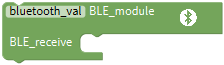

(4) Click“Serial Port” to find out
blockand place it into
block

(5) Click “Variables”to move out
blockinto
block

Complete Program：

Upload test code on V4.0 development board and insert the Bluetooth module. Then
we need to download APP.

For iOS system

**Note: Allow APP to access “location” in settings of your cellphone when
connecting to Bluetooth module. Otherwise, Bluetooth may not be connected.**

Search keyes BT car in App store

After installation, enter its interface.

Click “Connect”to search and pair Bluetooth. After connecting well, click
to enter the main page of 4WD
smart car.

**For Android System**

Enter Google play store to search keyes 4wd

Its interface is shown below:

Click on
APPicon，searching
the Bluetooth.

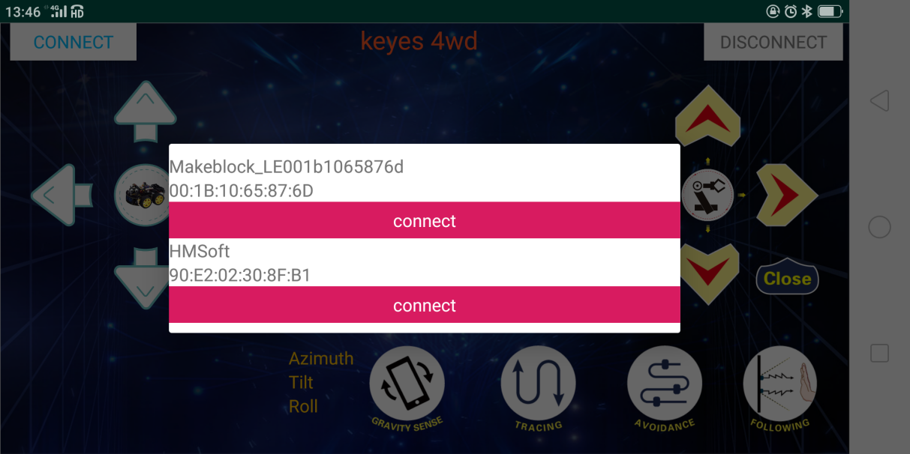

Click to connect the Bluetooth. HMSoft connected, Bluetooth LED will turn on
normally.

After successful connection, press the button of the Bluetooth APP, and the
corresponding characters are displayed in the serial monitor. For more details,
as shown below.

Below is app of 4WD robot car interface and we have listed out what function of
each key does

| Key                                             | Function|                                                          |
|-------------------------------------------------|---------|----------------------------------------------------------|
|  | match with connection HM-10 Bluetooth module|                      |
|  | disconnect Bluetooth|                                                          |
|  | Control character| Function                                                 |
|                                                 | Press: F Release: S| Press the button, robot car goes front; release to stop  |
|  | Press: L Release: S| Press the button, robot car turns left; release to stop  |
|  | Press: R Release: S| Press the button, robot car turns right; release to stop |
|  | Press: B Release: S| Press the button, robot car goes back; release to stop   |
|  | Click to start the mobile gravity sensing; click again to exit |              |
|  | Click to send “X” , then click “S”| Start line tracking function; click Stop to exit         |
|  | Click to send “Y” , then click “S”| Start ultrasonic avoiding function; click Stop to exit   |
|  | Click to send “U” , then click “S”| Start Ultrasonic follow function; click Stop to exit     |

1.  **Flow Chart**

After designing the smart car according to the previous ideas, we need to start
making smart cars according to the design ideas. We need to design the
corresponding wiring, test code, and then wire the upload code to run, to ensure
that the smart car can achieve the desired function.

1.  **Hook-up Diagram**

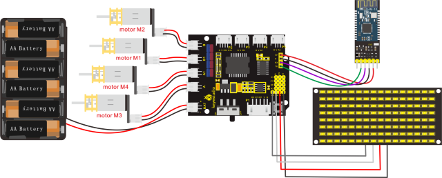

1.  **Test Code**

The program will be generated if you find the following file and drag it into
Mixly software.

| File Type | Route                                                               | File Name                               |
|-----------|---------------------------------------------------------------------|-----------------------------------------|
| MIX File  | ../tutorial for Mixly/Mixly Code/lesson_14_Bluetooth Remote Control | lesson_14.2_Bluetooth Control Smart Car |

You could edit code step by step as follows:

(1) Click “Control” to find out
block.

(2) Enter “Serial Port” to move
block

(3)
Click“Robot”→“4wd-SmartCar”→

(4) Leave them into block，and
click“↑”to choose“clear”.

(5) Copy blockonce and keep it
into ，then click“clear”to
select“V”.

1.  Replicate “robot”→
    “4wd-SmartCar”→.

(7) Enter“Serial Port”to move
blockinto
block；

Go to “Variables” to move out
blockblock.

(8) Click “Control” to move out
blockappears,
drag into
blockfor 5 times，the
blockis produced

(9) Go to “Variables” to drag
blockinto“switch”block.

1.  Click “Text” to move outand
    copy it for 4 times. Respectively set to F, B, L, R and S.

2.  Enter “4wd-SmartCar”to move out
    
    ,
     and
    . Set to 200.

3.  Replicate block for four
    times and separately select “↑”, “↓”, “←”, “→”and STOP.

4.  Place the above blocks into “case” block and edit the whole code string as
    follows:

1.  Click“Text”to move into the
    fifth case block；

2.  Go
    to“robot”→“4wd-SmartCar”→

3.  Place them into the fifth case block，click“↑”to select“STOP”.

Complete Program：

  **Test Result**

Upload the code on the keyestudio V4.0 board successfully. Stack the expansion
board on the keyestudio V4.0 board and wire it according to the connection
diagram. After power-on, the DIP switch will be dialed to the “ON” end. After
connecting Bluetooth successfully, we can use the mobile APP to control the
smart car to move.

### Assembly Guide

**Note: Peel the plastic film off the board first when installing the smart car.
To be honest, we never intend to send wood to you.**

  **Mount the Bottom PCB**

-   Prepare the parts as follows:

Gear Motor \*4

Fixed Part \*4

M3 Nickel Plated Nut \*10

M3\*6mm Round Head Screw \*14

4WD Bottom PCB \*1

Tracking Sensor \*1

Wheel \*4

5P Dupont Wire \*1

M3\*40mm Copper Pillar\*6

M3\*30m Round Head Screw \*8

M3\*8mm Round Head Screw \*2

  **Install Dot Matrix**

-   Prepare the parts as follows:

8X16 LED Panel \*1

4WD Baffle

4P Wire \*1

M2\*8mm Round Head Screw \*4

M2 Nut \*4

  **Install the Plastic Platform of Servo**

-   Prepare the parts as follows:

Servo \*1

M2\*4 Screw \*1

Black Cable Tie\*2

Ultrasonic Sensor\*1

Black Plastic Platform \*1

M1.2\*4 Tapping Screw \*4

M2\*8 Tapping Screw \*2

  **Assemble Battery Holder**

-   Prepare the parts as follows:

Top PCB \*1

M3 Nut \*3

Motor Driver Board \*1

Control Board \*1

IR Receiver Module \*1

M3\*10mm Copper Pillar \*8

M3\*8mm Round Head Screw \*1

M3\*6mm Round Head Screw \*16

M3\*10mm Flat Screw \*2

6 AA Battery Holder \*1

  **Mount the Top PCB**

-   Prepare the parts as follows:

Bluetooth Module \*1

M3\*6MM Round Head Screw \*6

Jumper Cap\*8

  **Hook-up Guide**

### Project 15: Multi-purpose Bluetooth Robot

**Description**

In previous projects, the robot car only performs single function, however, in
this lesson, we integrate all of function to control smart car via Bluetooth
control.

Here is a simple flow chart of multi-purpose robot car as for your reference.

**Flow Chart**

**Hook-up Diagram**

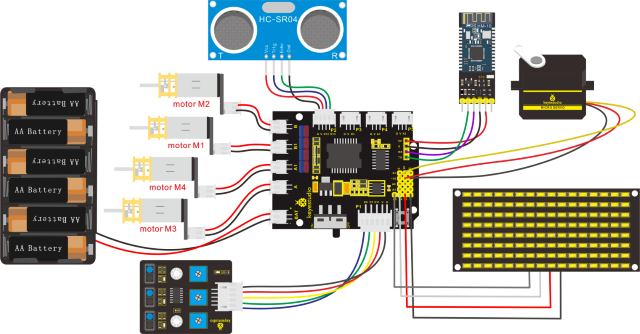

**Test Code**

The program will be generated if you find the following file and drag it into
Mixly software.

| File Type | Route                                                                    | File Name                               |
|-----------|--------------------------------------------------------------------------|-----------------------------------------|
| MIX File  | ../tutorial for Mixly/Mixly Code/lesson_15_Multi-purpose Bluetooth Robot | lesson_15_Multi-purpose Bluetooth Robot |

Complete Program：

(5)
**Test Result**

Upload the code on the keyestudio V4.0 board. Stack the expansion board on it
and wire them up according to the connection diagram. Plug in power and turn on
switch on robot car. After connecting to Bluetooth successfully, we could
control the smart car to move via App.

## 7. Resources

Wiki page: <https://wiki.keyestudio.com/Main_Page>

Official website: <https://keyestudio.com/>

Assembly Video Link: http://video.keyestudio.com/ks0470/
